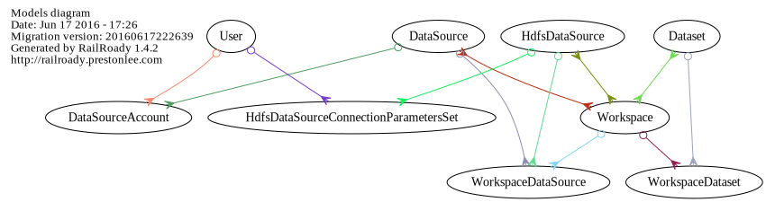
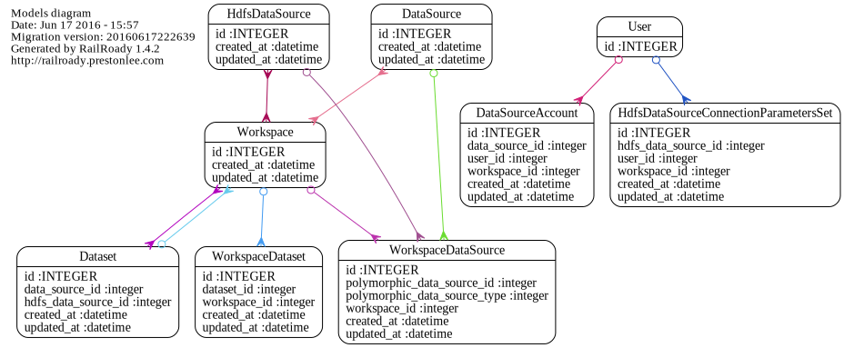

# README

A sample app developed to understand how best to model a feature "Data Visibility" ... developed inside of a huge app,
for a client of mine.

## Generating a model relationship diagram ...

We use a utility to generate a model relationship diagram: https://github.com/preston/railroady

To regenerate, simply do:

    rake diagram:models:all
 
 
