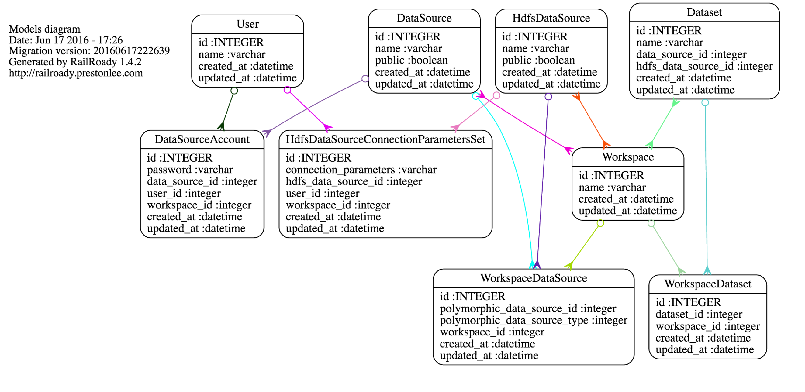

# README

A sample app developed to understand how best to implement a feature "Data Visibility" ... for a huge app.

## Explanation

There are 3 core models: "Workspaces," which have many "DataSources" and "Datasets."  A "DataSource" is roughly a database
server (think of Postgres).  A dataset is roughly a database table inside of Postgres.  

The point of the app is to allow access to the datasource "authorization" credentials to the datasources in various ways.
Another goal is for specific tables inside the database to be "pinned" or highlighted within the workspace.
 
There are three ways that a data source can be accessible to a workspace:
1) The DataSource is public and accessible to all workspaces.
2) The Workspace has a corresponding DataSourceAccount associated: it has both an associated WorkspaceDataSource and a DataSourceAccount.
3) The User has a corresponding DataSourceAccount associated: the workspace has an associated WorkspaceDataSource, but the user has the DataSourceAccount. 

There is one way in which a data source can be present within a workspace, but inaccessible:
1) The Workspace has a WorkspaceDataSource, but no DataSourceAccount can be found.

There are two types of DataSources: HdfsDataSources and regular DataSources.  HdfsDataSources do not have a DataSourceAccount 
(username / password) for authorization, instead they have a ConnectionParametersSet.  For brevity, this discussion uses
DataSourceAccount as the example.  HdfsDataSourceConnectionParameterSets behave similarly.

## Generating a model relationship diagram ...

We use a utility to generate a model relationship diagram: https://github.com/preston/railroady

To regenerate, simply do:

    rake diagram:models:all
  

## Generating annotations

Model annotations provided by canonical: https://github.com/ctran/annotate_models

To regenerate, simply do:

    bundle exec annotate